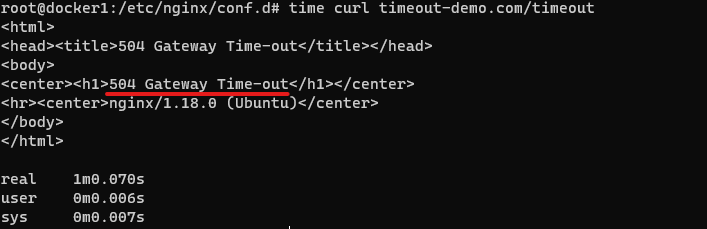

# 1. 개요
* nginx timeout 예제
* nginx는 연결된 세션이 60초(default) 동안 아무런 통신을 하지 않는다면 연결을 강제 종료

# 2. 준비
* nginx
* docker

# 3. webapp 실행방법
* docker를 이용하여 python webapp을 실행합니다.

```sh
docker run --rm -d --name=timeoutapp -p 9000:80 choisunguk/nginx-timeout:v1 
```

* api는 2개가 있습니다. timeout은 70후에 응답을 리턴합니다.
  * curl localhost:9000/normal
  * curl localhost:9000/timeout

* 도커 컨테이너를 삭제하려면 아래 명령어를 입력하세요.
```sh
docker kill timeoutapp
```

# 4. nginx 실행
* nginx 설정파일을 복사하고 설정을 재로드합니다.
```sh
cp ./nginx.conf /etc/nginx/conf.d/timeout_demo.conf
systemctl reload nginx
```

* /etc/hosts파일에 도메인을 설정합니다.
```sh
echo "127.0.0.1 timeout-demo.com" >> /etc/hosts
```

# 5. 테스트
> linux time명령어로 응답시간을 측정할 수 있습니다.

* normal api를 테스트합니다.
```sh
time curl timeout-demo.com/normal
```

* timeout api를 테스트합니다.
  * 504 gateway-timeout이 발생합니다.
```sh
time curl timeout-demo.com/timeout
```



# 6. 해결방법
* 첫 번째, timeout 시간을 변경합니다. 하지만, 좋지 못한 해결방법입니다. 설정한 시간이 더 늘어나면 또 수정해야합니다.
* 두 번째, 오래 걸리는 작업을 다른 곳에서 처리합니다. webapp은 요청을 받으면 60초 안에 응답을 리턴하고, 오래 걸리는 작업은 쓰레드, queue등을 이용하여 처리합니다. 해당 작업이 종료되면 클라이언트가 완료되었다는 메세지를 전달해야 합니다. 대표적으로 callback이 있습니다.

```python
def demo_background():
    # 70초 sleep
    time.sleep(70)

    # callback
    # requests.get(host)

@app.get("/timeout")
def timeout_api(background_tasks: BackgroundTasks):
    background_tasks.add_task(demo_background)
    return {"msg": "timeout"}
```
